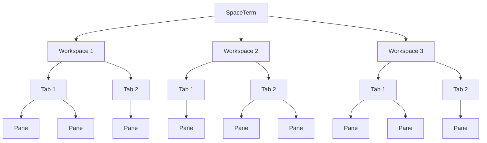

# SpaceTerm

A native desktop terminal multiplexer currently built for macOS.

> [!WARNING]
> SpaceTerm is under active development and has not reached its first release. Build it from source
> to try it today.

SpaceTerm brings terminal multiplexing into a native, keyboard-first desktop application.
Workspaces organize terminal work, Tabs separate tasks, and split Pane Layouts keep the shells you
need visible together.

## Highlights

- **Workspaces** for local and remote terminal work
- **Tabs and Panes** with recursive splits, focus, resize, and zoom
- **Remote terminals** through your existing OpenSSH configuration
- **Keyboard-first navigation** through the Command Palette and Directory Picker
- **Terminal essentials** including Scrollback, Selection, find, hyperlinks, and safe paste handling

## Workspace behavior

Press Command-N and choose This Mac or Remote over SSH. A new Workspace starts in your home
directory on that machine. New Tabs inherit the focused Pane's Current Directory, and new Panes
inherit the directory of the Pane being split. Workspace names stay stable as you navigate.

Choose Pin to Directory from the Workspace context menu to select a fixed Starting Directory,
or Pin Workspace to This Directory from a Pane menu to use that Pane's Current Directory.
The Tab context menu offers the same action when the Workspace has exactly one Tab and one Pane.
Change Pinned Directory and Unpin Directory are available from the Workspace context menu.
Pinning only affects future Terminal Sessions. If the source directory is unknown, a new terminal
starts at the user home directory on its machine.

## Workspace hierarchy



SpaceTerm can own multiple Workspaces, each Workspace can own multiple Tabs, and each Tab presents
one or more Panes through its Pane Layout.

## Built with

Rust powers the application, GPUI provides the native GPU-rendered interface, and `libghostty-vt`
provides terminal emulation. Remote Workspaces use the system OpenSSH client.

## Try SpaceTerm

You need macOS, Xcode 26 or newer, and [`mise`](https://mise.jdx.dev/).
Mise manages the official Zig compiler and the remaining development tools. Xcode supplies
the Metal compiler, macOS SDK, and icon packaging tools.

```sh
git clone https://github.com/sadiksaifi/SpaceTerm.git
cd SpaceTerm
mise trust

# Install pinned tools, initialize submodules, and verify the macOS development environment
mise run setup:macos

# Run from source
mise run dev

# Build, verify, and install to /Applications
mise run package:macos:install
```

Run `mise tasks` to see the complete command list. Rust is pinned in `rust-toolchain.toml`, and
development tools and tasks are pinned in `.mise.toml`. Platform-specific tasks carry an explicit
platform segment such as `:macos`.

Run `mise run validate:macos` for the full macOS validation suite, including SpaceTerm's patched
terminal library. Inside a SpaceTerm Pane, `mise run smoke:unix:kitty-graphics` displays image
layering and scaling checks.

The terminal engine is pinned in the `third_party/ghostty` submodule and built from source.
SpaceTerm maintains its Rust integration as local workspace dependencies. See
[the Ghostty integration guide](docs/ghostty-integration.md) for source, binding, and patch updates.

The default theme is built from the pinned `third_party/vague-pro-zed` submodule.
`mise run setup:macos` initializes it for new and existing checkouts. The build embeds the theme, so
the installed application needs no checkout or network access. UI colors follow Zed semantic roles; terminal
font sizing remains independent of UI sizing.
