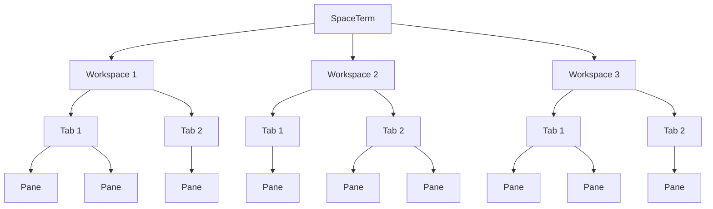

# SpaceTerm

A native desktop terminal multiplexer currently built for macOS.

> [!WARNING]
> SpaceTerm is under active development and has not reached its first release. Build it from source
> to try it today.

SpaceTerm brings terminal multiplexing into a native, keyboard-first desktop application.
Workspaces organize local and remote projects, Tabs separate tasks, and split Pane Layouts keep the
shells you need visible together.

## Highlights

- **Workspaces** for scratch shells, local projects, and remote projects
- **Tabs and Panes** with recursive splits, focus, resize, and zoom
- **Remote terminals** through your existing OpenSSH configuration
- **Keyboard-first navigation** through the Command Palette and Workspace Picker
- **Terminal essentials** including Scrollback, Selection, find, hyperlinks, and safe paste handling

## Workspace hierarchy



SpaceTerm can own multiple Workspaces, each Workspace can own multiple Tabs, and each Tab presents
one or more Panes through its Pane Layout.

## Built with

Rust powers the application, GPUI provides the native GPU-rendered interface, and `libghostty-vt`
provides terminal emulation. Remote Workspaces use the system OpenSSH client.

## Try SpaceTerm

You need macOS, a Rust toolchain, and [`just`](https://github.com/casey/just).

```sh
git clone https://github.com/sadiksaifi/SpaceTerm.git
cd SpaceTerm

# Run from source
just run

# Build, verify, and install to /Applications
just install-macos
```

Run `just` to see the complete command list.

Run `just validate` for the full validation suite, including SpaceTerm's patched terminal library.
Inside a SpaceTerm Pane, `just kitty-graphics-smoke` displays image layering and scaling checks.
