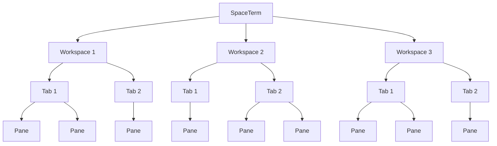

# SpaceTerm

A native desktop terminal multiplexer for macOS and Linux.

> [!WARNING]
> SpaceTerm is under active development and has not reached its first release. Build it from source
> to try it today.

SpaceTerm brings terminal multiplexing into a native, keyboard-first desktop application.
Workspaces organize terminal work, Tabs separate tasks, and split Pane Layouts keep the shells you
need visible together.

## Highlights

- **Workspaces** for local and remote terminal work
- **Tabs and Panes** with recursive splits, focus, resize, and zoom
- **Remote terminals** through your existing OpenSSH configuration
- **Keyboard-first navigation** through the Command Palette and Workspace Switcher
- **Terminal essentials** including Scrollback, Selection, find, hyperlinks, and safe paste handling

## Workspace hierarchy


```mermaid
flowchart TB
    SpaceTerm["SpaceTerm"]

    SpaceTerm --> W1["Workspace 1"]
    SpaceTerm --> W2["Workspace 2"]
    SpaceTerm --> W3["Workspace 3"]

    W1 --> W1T1["Tab 1"]
    W1 --> W1T2["Tab 2"]
    W2 --> W2T1["Tab 1"]
    W2 --> W2T2["Tab 2"]
    W3 --> W3T1["Tab 1"]
    W3 --> W3T2["Tab 2"]

    W1T1 --> W1T1P1["Pane"]
    W1T1 --> W1T1P2["Pane"]
    W1T2 --> W1T2P1["Pane"]
    W2T1 --> W2T1P1["Pane"]
    W2T2 --> W2T2P1["Pane"]
    W2T2 --> W2T2P2["Pane"]
    W3T1 --> W3T1P1["Pane"]
    W3T1 --> W3T1P2["Pane"]
    W3T2 --> W3T2P1["Pane"]
```

SpaceTerm can own multiple Workspaces, each Workspace can own multiple Tabs, and each Tab presents
one or more Panes through its Pane Layout.

## Built with

Rust powers the application, GPUI provides the native GPU-rendered interface, and `libghostty-vt`
provides terminal emulation. Remote Workspaces use the system OpenSSH client.

## Try SpaceTerm

Install [`mise`](https://mise.jdx.dev/) to manage the pinned development tools, including Zig.
Clone the repository and trust its tasks:

```sh
git clone https://github.com/sadiksaifi/SpaceTerm.git
cd SpaceTerm
mise trust
```

### macOS

You need Xcode 26 or newer for the Metal compiler, macOS SDK, and icon packaging tools.

```sh
# Install pinned tools, initialize submodules, and verify the development environment
mise run setup:macos

# Run from source
mise run dev

# Build, verify, and install to /Applications
mise run package:macos:install
```

### Linux

Wayland and X11 are supported. On Debian or Ubuntu, install the development libraries and
runtime tools:

```sh
sudo apt install build-essential pkg-config libxkbcommon-dev libxkbcommon-x11-dev \
  libwayland-dev libxcb1-dev libx11-xcb-dev libfontconfig-dev libfreetype-dev \
  libvulkan1 mesa-vulkan-drivers ncurses-bin openssh-client dbus

mise run setup:linux
mise run doctor:linux
mise run dev
```

`setup:linux` installs pinned tools, initializes submodules, and runs the environment checks.
`doctor:linux` repeats those checks. `dev` uses Wayland when available; `mise run dev:linux:x11`
selects X11. GNOME Sushi (`gnome-sushi`) is optional for File Preview.
Linux currently supports source builds only, with no packages, distribution, or updates.

Run `mise tasks` to see the complete command list. Rust is pinned in `rust-toolchain.toml`, and
development tools and tasks are pinned in `.mise.toml`. Platform-specific tasks carry an explicit
platform segment such as `:macos` or `:linux`.
