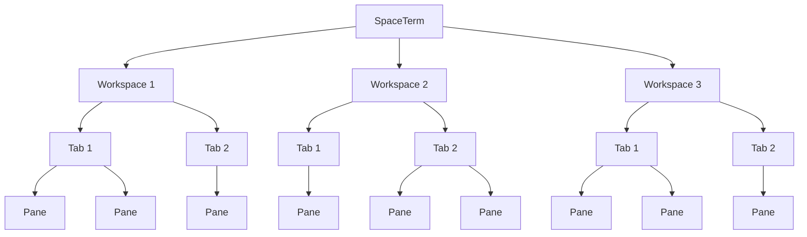

# SpaceTerm

A native desktop terminal multiplexer currently built for macOS.

SpaceTerm brings terminal multiplexing into a native, keyboard-first desktop application.
Workspaces organize terminal work, Tabs separate tasks, and split Pane Layouts keep the shells you
need visible together.

## Highlights

- **Workspaces** for local and remote terminal work
- **Tabs and Panes** with recursive splits, focus, resize, and zoom
- **Remote terminals** through your existing OpenSSH configuration
- **Keyboard-first navigation** through the Command Palette and Workspace Switcher
- **Terminal essentials** including Scrollback, Selection, find, hyperlinks, and safe paste handling

## Install

SpaceTerm requires macOS 26 or newer on Apple silicon.

```sh
curl -fsSL https://github.com/sadiksaifi/SpaceTerm/releases/latest/download/install.sh | sh
```

Or install with Homebrew:

```sh
brew install --cask sadiksaifi/tap/spaceterm
```

## Workspace hierarchy


```mermaid
flowchart TB
    SpaceTerm["SpaceTerm"]

    SpaceTerm --> W1["Workspace 1"]
    SpaceTerm --> W2["Workspace 2"]
    SpaceTerm --> W3["Workspace 3"]

    W1 --> W1T1["Tab 1"]
    W1 --> W1T2["Tab 2"]
    W2 --> W2T1["Tab 1"]
    W2 --> W2T2["Tab 2"]
    W3 --> W3T1["Tab 1"]
    W3 --> W3T2["Tab 2"]

    W1T1 --> W1T1P1["Pane"]
    W1T1 --> W1T1P2["Pane"]
    W1T2 --> W1T2P1["Pane"]
    W2T1 --> W2T1P1["Pane"]
    W2T2 --> W2T2P1["Pane"]
    W2T2 --> W2T2P2["Pane"]
    W3T1 --> W3T1P1["Pane"]
    W3T1 --> W3T1P2["Pane"]
    W3T2 --> W3T2P1["Pane"]
```

SpaceTerm can own multiple Workspaces, each Workspace can own multiple Tabs, and each Tab presents
one or more Panes through its Pane Layout.

## Documentation

See the [SpaceTerm guide](docs/guide.md) for terminal clipboard setup and source builds.
