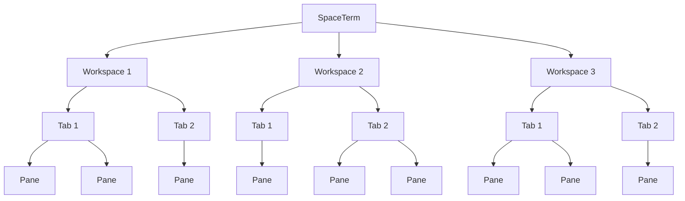

# SpaceTerm

A native desktop terminal multiplexer for macOS and Linux, coming soon for Windows.


## Highlights

- **Workspaces** for local and remote terminal work
- **Tabs and Panes** with recursive splits, focus, resize, and zoom
- **Remote terminals** through your existing OpenSSH configuration
- **Keyboard-first navigation** through the Command Palette and Workspace Switcher

## Install macOS/Linux

```sh
curl -fsSL https://github.com/sadiksaifi/SpaceTerm/releases/latest/download/install.sh | sh
```

On a Mac, you can also install with Homebrew:

```sh
brew install --cask sadiksaifi/tap/spaceterm
```

## Workspace hierarchy


```mermaid
flowchart TB
    SpaceTerm["SpaceTerm"]

    SpaceTerm --> W1["Workspace 1"]
    SpaceTerm --> W2["Workspace 2"]
    SpaceTerm --> W3["Workspace 3"]

    W1 --> W1T1["Tab 1"]
    W1 --> W1T2["Tab 2"]
    W2 --> W2T1["Tab 1"]
    W2 --> W2T2["Tab 2"]
    W3 --> W3T1["Tab 1"]
    W3 --> W3T2["Tab 2"]

    W1T1 --> W1T1P1["Pane"]
    W1T1 --> W1T1P2["Pane"]
    W1T2 --> W1T2P1["Pane"]
    W2T1 --> W2T1P1["Pane"]
    W2T2 --> W2T2P1["Pane"]
    W2T2 --> W2T2P2["Pane"]
    W3T1 --> W3T1P1["Pane"]
    W3T1 --> W3T1P2["Pane"]
    W3T2 --> W3T2P1["Pane"]
```

## Copy and paste over SSH and tmux

Programs can copy to your clipboard even when they run on another machine.
Neovim and tmux each need a setting first. See [terminal clipboard setup](docs/terminal-clipboard.md).

## For program authors

A program running in SpaceTerm can offer macOS permission setup with a
[Permission Request](docs/permission-request.md).
