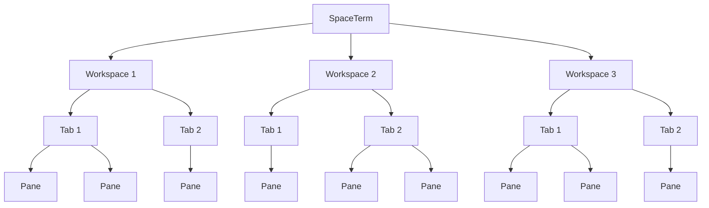

# SpaceTerm

A native desktop terminal multiplexer currently built for macOS.

> [!WARNING]
> SpaceTerm is under active development and has not reached its first release. Build it from source
> to try it today.

SpaceTerm brings terminal multiplexing into a native, keyboard-first desktop application.
Workspaces organize terminal work, Tabs separate tasks, and split Pane Layouts keep the shells you
need visible together.

## Highlights

- **Workspaces** for local and remote terminal work
- **Tabs and Panes** with recursive splits, focus, resize, and zoom
- **Remote terminals** through your existing OpenSSH configuration
- **Keyboard-first navigation** through the Command Palette and Workspace Switcher
- **Terminal essentials** including Scrollback, Selection, find, hyperlinks, and safe paste handling

## Workspace hierarchy


```mermaid
flowchart TB
    SpaceTerm["SpaceTerm"]

    SpaceTerm --> W1["Workspace 1"]
    SpaceTerm --> W2["Workspace 2"]
    SpaceTerm --> W3["Workspace 3"]

    W1 --> W1T1["Tab 1"]
    W1 --> W1T2["Tab 2"]
    W2 --> W2T1["Tab 1"]
    W2 --> W2T2["Tab 2"]
    W3 --> W3T1["Tab 1"]
    W3 --> W3T2["Tab 2"]

    W1T1 --> W1T1P1["Pane"]
    W1T1 --> W1T1P2["Pane"]
    W1T2 --> W1T2P1["Pane"]
    W2T1 --> W2T1P1["Pane"]
    W2T2 --> W2T2P1["Pane"]
    W2T2 --> W2T2P2["Pane"]
    W3T1 --> W3T1P1["Pane"]
    W3T1 --> W3T1P2["Pane"]
    W3T2 --> W3T2P1["Pane"]
```

SpaceTerm can own multiple Workspaces, each Workspace can own multiple Tabs, and each Tab presents
one or more Panes through its Pane Layout.

## Built with

Rust powers the application, GPUI provides the native GPU-rendered interface, and `libghostty-vt`
provides terminal emulation. Remote Workspaces use the system OpenSSH client.

## Try SpaceTerm

You need macOS, Xcode 26 or newer, and [`mise`](https://mise.jdx.dev/).
Mise manages the official Zig compiler and the remaining development tools. Xcode supplies
the Metal compiler, macOS SDK, and icon packaging tools.

```sh
git clone https://github.com/sadiksaifi/SpaceTerm.git
cd SpaceTerm
mise trust

# Install pinned tools, initialize submodules, and verify the macOS development environment
mise run setup:macos

# Run from source
mise run dev

# Build, verify, and install to /Applications
mise run package:macos:install
```

Run `mise tasks` to see the complete command list. Rust is pinned in `rust-toolchain.toml`, and
development tools and tasks are pinned in `.mise.toml`. Platform-specific tasks carry an explicit
platform segment such as `:macos`.

## Releases and updates

Release DMGs are hosted in [GitHub Releases](https://github.com/sadiksaifi/SpaceTerm/releases)
for Apple Silicon Macs running macOS 26.0 or later. This minimum also applies to development
builds. Intel Macs are unsupported. Drag SpaceTerm into Applications before opening it.
These builds use ad hoc signing. If macOS blocks the first launch, follow Apple's
[Open Anyway instructions](https://support.apple.com/en-us/102445) in Privacy & Security.

Installed releases check at startup and daily while running. Downloads are automatic by default.
Settings > Updates controls downloads, check frequency, and overdue reminder frequency. The
SpaceTerm menu also provides Check for Updates. Every update is verified with the embedded public
key. Restarting an open app requires confirmation; ordinary quit can finish a verified update so
its next launch is already current. Development builds do not update themselves.

Each release is optional for 24 hours after its signed publication date, then shows a gentle
reminder. After 48 hours an open app shows a dismissible reminder every two hours by default and
keeps all terminal work usable. A fresh launch obtains and installs an overdue update before
creating Workspaces. Failed or stalled checks/downloads allow access, including offline. A prepared
update resumes automatically on a fresh launch. Settings cannot change these deadlines.

To preview without publishing, run `mise run dev:macos:updates`. The real controls use a synthetic
`0.1.1` update. Nothing is downloaded, installed, or restarted. Preview scenarios include:

- `warning` and `overdue`: reminders in an open Workspace.
- `startup-overdue` and `startup-ready`: automatic startup update flow.
- `offline`: access after a failed startup check.
- `up-to-date`, `check-error`, `download-error`, `verification-error`, and `install-error`: results
  and recoverable failures.

For example, `mise run dev:macos:updates overdue` previews the overdue banner. Quit the preview
before selecting another scenario. The mock updater is excluded from release builds.

Releases are managed by [Tagsmith](https://tagsmith.site/).
Use `npx tagsmith@latest` to create and validate release tags. The annotated Git tag supplies every
release version after removing the `v` prefix; there is no Cargo version bump or separate build number.
The first release tag is `v0.1.0`.

Before the first release, run `mise run release:macos:key` to retain the signing key in macOS
Keychain, then `mise run release:macos:configure-secret` to provision the repository's Actions
secret. Keep a secure backup of that Keychain key: losing it requires users to install a new copy
manually. Only the public key belongs in the repository.

Run `mise run release:preview 0.1.0` on the intended clean commit to review the tag before creating
it. Pushing an annotated release tag runs validation, creates and signs the arm64 package, and
publishes the DMG, signed `appcast.xml`, and `SHA256SUMS` together. A published release is never
overwritten; corrections require a new tag.

Run `mise run validate:macos` for the full macOS validation suite, including SpaceTerm's patched
terminal library. Both `validate:portable` and `validate` include GPUI scene-ordering tests.
`validate` also requires the host renderer checks: Metal pixel tests and Blade compilation on
macOS, Blade/WGSL compilation on Linux, and native MSVC/DirectX/HLSL compilation on Windows.
The Windows check requires the Windows SDK's FXC compiler; cross-checking Windows from another
platform does not validate HLSL. Inside a SpaceTerm Pane, `mise run smoke:unix:kitty-graphics`
displays image layering and scaling checks.

The terminal engine is pinned in the `third_party/ghostty` submodule and built from source.
SpaceTerm maintains its Rust integration as local workspace dependencies. See
[the Ghostty integration guide](docs/ghostty-integration.md) for source, binding, and patch updates.

SpaceTerm authors paired Light and Dark appearances for the interface and terminal. Neutral
surfaces share one material hierarchy across opaque and translucent appearance. The interface
appearance is fixed apart from density. Terminal Themes and terminal fonts are selectable, and any
theme published for Zed can be installed from Settings.
