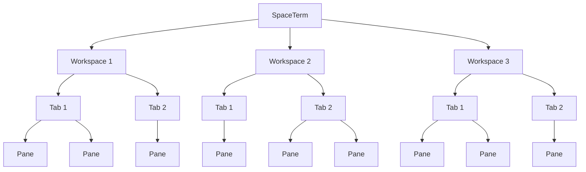

# SpaceTerm

A native desktop terminal multiplexer currently built for macOS.

> [!WARNING]
> SpaceTerm is under active development and has not reached its first release. Build it from source
> to try it today.

SpaceTerm brings terminal multiplexing into a native, keyboard-first desktop application.
Workspaces organize terminal work, Tabs separate tasks, and split Pane Layouts keep the shells you
need visible together.

## Highlights

- **Workspaces** for local and remote terminal work
- **Tabs and Panes** with recursive splits, focus, resize, and zoom
- **Remote terminals** through your existing OpenSSH configuration
- **Keyboard-first navigation** through the Command Palette and Workspace Switcher
- **Terminal essentials** including Scrollback, Selection, find, hyperlinks, and safe paste handling

## Workspace hierarchy


```mermaid
flowchart TB
    SpaceTerm["SpaceTerm"]

    SpaceTerm --> W1["Workspace 1"]
    SpaceTerm --> W2["Workspace 2"]
    SpaceTerm --> W3["Workspace 3"]

    W1 --> W1T1["Tab 1"]
    W1 --> W1T2["Tab 2"]
    W2 --> W2T1["Tab 1"]
    W2 --> W2T2["Tab 2"]
    W3 --> W3T1["Tab 1"]
    W3 --> W3T2["Tab 2"]

    W1T1 --> W1T1P1["Pane"]
    W1T1 --> W1T1P2["Pane"]
    W1T2 --> W1T2P1["Pane"]
    W2T1 --> W2T1P1["Pane"]
    W2T2 --> W2T2P1["Pane"]
    W2T2 --> W2T2P2["Pane"]
    W3T1 --> W3T1P1["Pane"]
    W3T1 --> W3T1P2["Pane"]
    W3T2 --> W3T2P1["Pane"]
```

SpaceTerm can own multiple Workspaces, each Workspace can own multiple Tabs, and each Tab presents
one or more Panes through its Pane Layout.

## Terminal clipboard

Programs in the Pane with Terminal Input Focus can copy plain text through OSC 52, including over
SSH and in fullscreen terminal interfaces. Settings > Privacy > Clipboard controls copying and
reading separately. Copying is enabled by default. Reading is disabled by default; enabling it
lets the focused terminal program read your system clipboard. Requests are limited to 1 MiB of text.

Cmd+C copies SpaceTerm's Selection. With no Selection, applications that enable the enhanced
keyboard protocol receive Cmd+C. Cmd+V follows SpaceTerm's paste handling, including bracketed
paste. When an application captures the mouse, Shift-drag creates a SpaceTerm Selection.

For Neovim, select its OSC 52 provider explicitly:

```lua
vim.g.clipboard = 'osc52'
vim.opt.clipboard = 'unnamedplus'
```

Yanks use the system clipboard. Pasting through Neovim's OSC 52 provider also requires enabling
clipboard reading in SpaceTerm. Denied or unavailable reads return empty text.

For tmux, allow application clipboard writes in `~/.tmux.conf`:

```tmux
set -s set-clipboard on
```

SpaceTerm advertises the `Ms` terminal capability. In tmux 3.7c and newer, forwarding application
clipboard reads also requires `set -s get-clipboard request`. Enable `set -g mouse on` if you want
tmux to route mouse input to fullscreen applications. Reload the configuration or restart tmux
after changing these settings. Nested multiplexers must forward OSC 52 at every layer.

[Neovim clipboard provider](https://neovim.io/doc/user/provider/#clipboard-osc52) and
[tmux clipboard configuration](https://github.com/tmux/tmux/wiki/Clipboard) describe program setup.
Codex CLI, Claude Code, pi, and Herdr can use their own Selection and copy commands when they emit
OSC 52. Their paste behavior also depends on the program and multiplexer configuration.

## Built with

Rust powers the application, GPUI provides the native GPU-rendered interface, and `libghostty-vt`
provides terminal emulation. Remote Workspaces use the system OpenSSH client.

## Try SpaceTerm

You need macOS, Xcode 26 or newer, and [`mise`](https://mise.jdx.dev/).
Mise manages the official Zig compiler and the remaining development tools. Xcode supplies
the Metal compiler, macOS SDK, and icon packaging tools.

```sh
git clone https://github.com/sadiksaifi/SpaceTerm.git
cd SpaceTerm
mise trust

# Install pinned tools, initialize submodules, and verify the macOS development environment
mise run setup:macos

# Run from source
mise run development

# Build, verify, and install to /Applications
mise run preflight:install:macos
```

Run `mise tasks` to see the complete command list. Rust is pinned in `rust-toolchain.toml`, and
development tools and tasks are pinned in `.mise.toml`. Platform-specific tasks carry an explicit
platform segment such as `:macos`.
